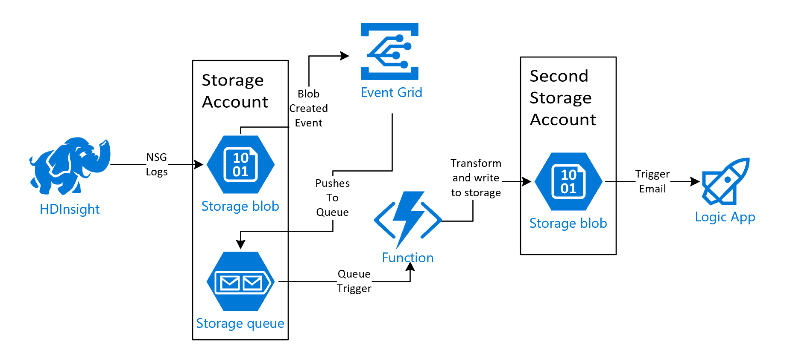
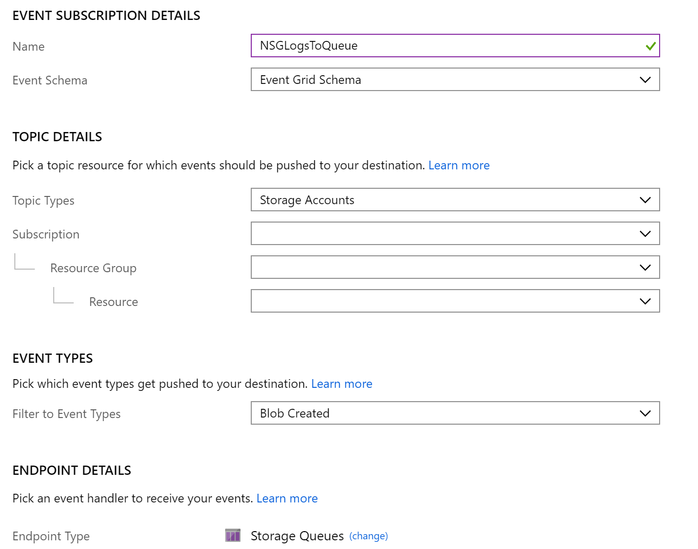
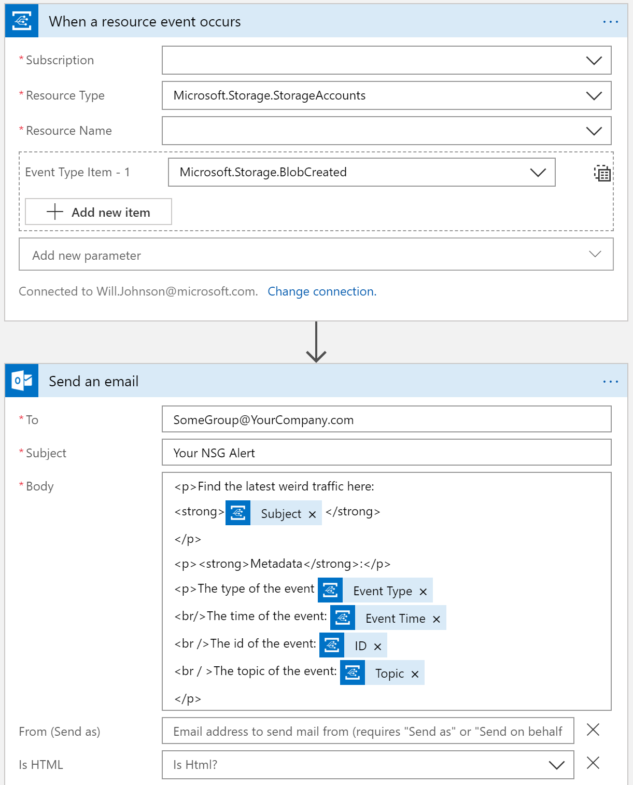

# Reading NSG logs from Blob Storage with an Azure Function

**Please see the [original script](https://github.com/erjosito/get_nsg_logs/blob/master/get_nsg_logs.py) from Jose Moreno for more insight into how the parsing / `get_nsg_logs.py` script works.**  This repository HEAVILY draws on the work done by Jose and we appreciate the great path he paved for us.

This repository contains the code for an Azure Function that parses NSG Logs and extracts the anomalous outbound traffic.

Specifically, it looks for a set of AND conditions.  The defaults hardcoded into the function are:
* The file being parsed contain records from the past one (1) minute.
* Destination IP Address is Not In a list of current IP's resolved from the list of [HTTP/HTTPS dependencies](https://docs.microsoft.com/en-us/azure/hdinsight/hdinsight-restrict-outbound-traffic#fqdn-httphttps-dependencies).
* NSG Rule Is "UserRule_Port_other",
* Direction Is "O" (i.e. outbound)

## Necessary Resources and Steps

### Storage Accounts
1. Deploy an HDInsight cluster with NSG logs streaming to a **Gen 2 Storage account**.  Let's call it *Storage A*.
1. Ensure *Storage A* contains a container called **insights-logs-networksecuritygroupflowevent**.
1. In *Storage A*, create a **storage queue** called **insights-logs-networksecuritygroupflowevent-queue**.
1. Create a **second Gen 2 storage account** for the final outputs.  Let's call it *Storage B*.
1. Create a container in *Storage B*  called **insights-logs-networksecuritygroupflowevent-output**.

### Event Grid
1. Create an **Event Grid Subscription** with the following parameters
    * Event Schema: Event Grid Schema
    * Topic Types: Storage Account
    * Event Types: Blob Created
    * Endpoint Type: Storage Queues
    * 

### Function
1. Create an Azure **App Service Plan** with the following parameters:
    * Operating System: Linux
1. Create an **Azure Function** with the following parameters:
    * OS: Linux
    * Publish: Code
    * Hosting Plan: App Service Plan (select the plan just created)
    * Runtime Stack: Python
    * Storage: Either option
    * Application Insights: Enable
1. Deploy the Azure Function in this repo with VS Code ([tutorial](https://docs.microsoft.com/en-us/azure/azure-functions/tutorial-vs-code-serverless-python)).
1. Upload application settings ([see here](#sample-local.settings.json)) for **input_STORAGE** and **output_STORAGE**.

### Logic App
1. Create an **Azure Logic App** with the following configuration:
    * Event Grid Trigger focusing on *Storage Account B*.
    * In the trigger, include an Event Type Item of Blob Created.
    * The following action would be a Send Email action from your email provider (e.g. Outlook, Gmail) to your security group's email alias.
    * 

## Sample local.settings.json
You will need to add a local.settings.json / application settings of:

    {
      "IsEncrypted": false,
      "Values": {
        "AzureWebJobsStorage": "",
        "FUNCTIONS_WORKER_RUNTIME": "python",
        "input_STORAGE": "",
        "output_STORAGE": ""
      }
    }
